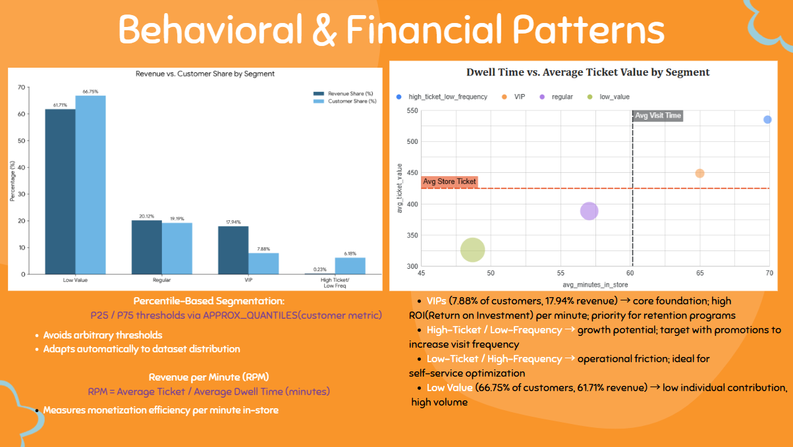

# Penlink_project
#  The Shefa Be-Paa Initiative: Orchestrating Retail Efficiency
> **Retail Analytics: Operational Optimization at Shefa Issachar Supermarket**

##  Project Overview
This project delivers an end-to-end analysis of the Yavne branch operations for the **Shefa Issachar** supermarket chain. By leveraging geolocation and transactional data from June to November 2025, the study transforms raw operational data into strategic insights regarding workforce scaling, self-checkout investment, and customer monetization.

---

##  Tools & Technologies
* **Google BigQuery (SQL):** Data cleaning, Exploratory Data Analysis (EDA), and complex KPI development.
* **Looker:** Interactive Dashboard Development (**Work in Progress**).
* **Google Sheets:** Statistical modeling and implementation of **Linear Regression** analysis for trend forecasting.
* **Advanced Statistics:** Percentile-based normalization ($P25$ / $P75$) for demand peak detection and customer segmentation.

---

##  Visual Insights
*(A preview of the analysis performed using Looker and Data Visualization techniques)*

<p align="center">
  
</p>

---

##  Technical Challenges & Solutions

### 1. Data Quality & Cleaning (The 31.76% Filter)
Identified that **31.76% of GPS signals** were imprecise (>30m). I implemented spatial precision filters to ensure the dwell time analysis reflected actual in-store behavior, successfully excluding parking lot noise and signal drift.

### 2. Anomaly Detection
Validated actual operational hours by cross-referencing sales logs with customer presence. This allowed the identification of unexpected closures and extreme demand days that skewed traditional averages.

### 3. Dynamic Segmentation (3x3 Matrix)
Developed a **3x3 matrix** based on *Average Ticket* and *Visit Frequency*. This segmentation was crucial to identify the **"VIP" segment**, which, despite being a smaller group, drives the majority of total revenue.

---

##  Key Business Insights
* **Demand Concentration:** Customer flow and operational pressure are non-uniform, peaking drastically on **Thursdays and Fridays**. Recommendation: Dynamic staffing.
* **Loyalty & App Engagement:** The supermarket app shows exceptionally high penetration, linked to **89.6% of total sales**. This makes the app the primary channel for personalized marketing.
* **Checkout Efficiency:** Analysis proved that self-checkouts should serve as an **operational buffer** during peaks and a cost-reduction lever during "dead hours," rather than a one-size-fits-all solution.

---

##  Repository Structure
```text
├── sql/             # Full script covering data cleaning, business logic, and regression.
├── img/             # Visualizations and Looker dashboard snapshots.
├── regression/      # Spreadsheet with Linear Regression and statistical calculations.
└── reports/         # Final Technical & Executive Report (PDF).


